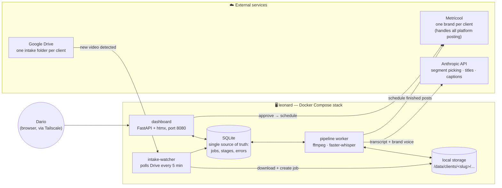
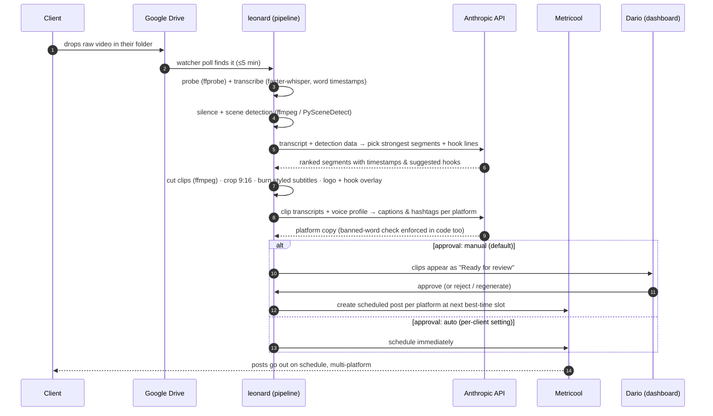

# Octopus & Son — Automated Client Content Pipeline

**Architecture proposal · v1 · 2026-08-17 · awaiting Dario's sign-off**

This is the design pass requested by the build brief: components, data flow, what runs where,
and what it costs monthly. No production code has been written yet. Read top to bottom;
the diagrams show the sequence, the tables show the money, and the last section lists the
decisions I need from you before Phase 1 starts.

---

## 0. What I verified before designing

- **Metricool**: your account (`dario@octopusandson.com`) is connected and working — I can see
  your existing brands ("Nexxt Ideas", "First Goal Contest", plus one shared client brand).
  Each pipeline client maps 1:1 to a Metricool **brand** (its `blogId` goes in the client config).
  No "Le Café Studio" brand exists yet — creating it is an onboarding step.
- **Repo**: `dariohudon/loom` is an active, unrelated project with its own hourly commit cadence
  on `main`. This proposal lives in a new folder on a side branch and touches nothing else.
  **Recommendation: create a dedicated repo (e.g. `octopusandson/content-pipeline`) before any
  Phase 1 code lands.** A pipeline should not share a repo with a live art project.

### Open items you need to check (neither blocks sign-off)

1. **leonard's specs** — run this on leonard and send me the output:
   ```bash
   nproc && free -h && (lspci | grep -i nvidia || echo "no NVIDIA GPU") && df -h /
   ```
   The design below assumes **CPU-only** (worst case). A GPU just makes transcription and
   rendering faster; nothing else changes.
2. **Metricool plan** — check *Settings → API* in Metricool. The pipeline needs an **API token**,
   which Metricool includes on the **Advanced plan (~US$45–50/mo)**. If you're on a lower tier,
   Phase 2 has a fallback (§7) but the clean path is the upgrade — one plan covers all client brands.

---

## 1. Design principles (from the brief, made concrete)

| Brief requirement | Design answer |
|---|---|
| One connected pipeline, no manual hand-offs | A single state machine per video. Every stage writes its result and the next stage picks it up automatically. There is no step where a human moves a file. |
| You watch, not operate | The dashboard is read-mostly: your only verbs are approve / reject / regenerate. |
| Boring, reliable tools | ffmpeg, faster-whisper, SQLite, Python, Docker Compose. The only paid API in the hot path is Anthropic (small dollars, see §8). |
| Config-driven, zero per-client code | One YAML file + one assets folder per client (§5). Adding a client = new folder + new Drive folder + new Metricool brand. |
| Fail loudly | Every stage failure is recorded with a plain-English message and shows as a red card on the dashboard the moment it happens. |

---

## 2. Components — what runs where

Everything runs on **leonard** as one Docker Compose stack. Google Drive and Metricool are the
only external services in the loop; Anthropic is called for analysis and copy.



- **intake-watcher** — polls each client's Drive folder via the Drive API (service account),
  downloads new video/image files, dedupes by content hash, creates a job row. Polling (not
  webhooks) because leonard shouldn't need a public inbound endpoint.
- **pipeline worker** — walks each job through the stages in §3. One worker process; stages for
  different jobs interleave. At 1–3 clients (~5–15 videos/week) a queue server is gold-plating —
  SQLite job states + one worker is enough, and the design lets us add a second worker later
  without rework.
- **dashboard** — the review surface (§6). Served on leonard; reach it over **Tailscale**
  (recommended — free, zero ports exposed to the internet) or LAN.
- **SQLite** — every job, stage transition, error, and approval lives here. The dashboard is
  just a view over this database, which is what makes "see exactly what happened at each step"
  cheap and always true.

---

## 3. The pipeline — stage by stage

Each raw video becomes N clips (default: one ~60s and one ~30s per strong moment, 9:16).
Each stage records `ok | failed` + a human-readable note.



**Stage details and tool choices**

| # | Stage | Tool | Notes |
|---|---|---|---|
| 1 | Ingest | Google Drive API | Poll, download, sha256 dedupe, archive raw file locally |
| 2 | Probe | ffprobe | Duration, resolution, audio present? Fails loud on corrupt files |
| 3 | Transcribe | **faster-whisper** (local, free) | `small`/`medium` int8 on CPU; word-level timestamps drive karaoke subtitles. GPU or paid API only if leonard is too slow |
| 4 | Moment finding | ffmpeg `silencedetect` + PySceneDetect + **Claude** | Detection gives candidate boundaries; Claude reads the timestamped transcript and ranks moments by hook strength. Not random cuts — the transcript decides |
| 5 | Cut & crop | ffmpeg | Trim to ~60s/~30s on sentence boundaries; 9:16 center-crop with a per-client focal bias setting (face-tracking auto-reframe is on the Later list) |
| 6 | Subtitles | ASS subtitles → ffmpeg burn-in | Style (font, colors, position, karaoke vs block) comes entirely from the brand kit; client fonts loaded via `fontsdir` |
| 7 | Branding | ffmpeg overlay/drawtext | Logo watermark (position/opacity from brand kit) + hook/title card |
| 8 | Copy | **Claude** | Caption + hashtags per platform, in the client's voice profile; banned words are also hard-filtered in code, not just prompted away |
| 9 | Package | — | `clip.mp4` + `post.json` (copy, platforms, target time) per clip |
| 10 | Schedule | Metricool REST API | One brand per client; posts placed at the next open slot matching the client's cadence + Metricool best-time data |

---

## 4. Storage layout on leonard

```
/data/
  clients/
    le-cafe-studio/
      raw/        # originals as received (archived, never modified)
      work/       # transcripts, detection data, intermediate cuts
      out/
        2026-08-17_espresso-pour/
          clip-01-60s.mp4
          clip-01-30s.mp4
          post.json
  pipeline.db     # SQLite
```

Raw files are kept ~90 days then rotated (configurable) — Drive remains the client-facing archive.

---

## 5. Client config — the whole personalization model

One folder per client in the (new) repo: `clients/<slug>/client.yml` + `clients/<slug>/assets/`
(logo, fonts). Nothing about a client exists anywhere else. Example:

```yaml
name: Le Café Studio
slug: le-cafe-studio

intake:
  drive_folder_id: "1AbC..."        # shared folder the client drops into

brand:
  logo: assets/logo.png
  fonts:
    hook: assets/fonts/ClashDisplay-Semibold.otf
    subtitle: assets/fonts/Inter-SemiBold.ttf
  colors: { primary: "#3B2F2F", accent: "#E8B04B", subtitle_text: "#FFFFFF" }
  subtitle_style: karaoke            # karaoke | block | minimal
  watermark: { position: bottom-right, opacity: 0.85 }

voice:
  tone: "Warm, unhurried; third-wave coffee nerd but never snobby."
  example_captions:
    - "Rainy Tuesday, single-origin Guatemala on the bar. You know where to find us."
  banned_words: ["cheap", "#coffeeaddict"]
  banned_topics: ["competitor names"]

platforms:
  instagram_reels: { per_week: 3 }
  tiktok:          { per_week: 3 }
  youtube_shorts:  { per_week: 2 }

scheduling:
  metricool_blog_id: 0               # filled at onboarding after creating the brand
  timing: best_time                  # use Metricool best-time data
  approval: manual                   # manual | auto

output:
  clip_lengths_s: [60, 30]
  aspect: "9:16"
```

**Onboarding a client** (the under-30-minutes test): create Drive folder + share with client →
create Metricool brand + connect their socials (this is the longest step and it's Metricool's UI,
not ours) → copy a client folder template, fill the YAML, drop in logo/fonts → restart nothing;
the watcher picks up the new config. No code changes.

---

## 6. Dashboard — your monthly review surface

FastAPI + htmx, server-rendered, deliberately plain. One screen per client:

- **Pipeline board** — every incoming asset as a card moving through:
  `Received → Transcribed → Clips cut → Branded → Copy ready → In review → Scheduled → Posted`
  A failed stage turns the card red with the plain-English error ("Transcription failed:
  the file has no audio track") and a retry button.
- **Review queue** — each finished clip with inline video preview, the generated caption/hashtags
  (editable in place), target platforms and time, and three buttons:
  **Approve** (→ scheduled in Metricool) · **Reject** (→ archived, logged why) ·
  **Regenerate** (→ re-runs copy, or re-cuts with a note like "use the part about the roaster").
- Approval modes: **manual** (default) — clips wait in the review queue; **auto** — clips go
  straight to Metricool as scheduled posts and the dashboard just shows what happened.
  Per-client toggle, exactly as the brief specifies.

Access: single shared password over Tailscale. Client-facing logins are on the Later list.

---

## 7. Metricool integration

- Pipeline talks to the **Metricool REST API** with your account token; each post is created
  against the client's `blogId` at the chosen time. In manual mode, nothing reaches Metricool
  until you approve on the dashboard — so what's in Metricool is always intentional.
- Metricool's own "send for review" flow exists too; we can additionally route posts through it
  for clients who want to approve their own content inside Metricool (Later list).
- **If you're not on the Advanced plan**: fallback is that the pipeline stages everything as
  `out/` files + copy, and the dashboard gets a "copy to clipboard + open Metricool planner"
  shortcut per post. Workable, but it reintroduces a manual hand-off — which the brief forbids —
  so treat the plan upgrade as part of the product's cost of goods.

---

## 8. Monthly cost estimate (1–3 clients, ~5–15 raw videos/week)

| Item | Cost | Notes |
|---|---|---|
| Anthropic API | **~US$5–15/mo** | ~3–5 calls per video (segment ranking, hooks, per-platform copy). Roughly $0.10–0.25 per raw video at this design. Scales linearly with volume |
| Transcription | **$0** | faster-whisper local on leonard. Contingency: if leonard is genuinely too slow, a paid API at ~$0.006/min is ≈$4/mo at this volume |
| ffmpeg / dashboard / storage | **$0** | Self-hosted on leonard |
| Google Drive | **$0–3/mo** | Free inside existing storage; Google One 200GB is ~CA$4 if clients upload heavily |
| Metricool Advanced | **~US$45–50/mo** | Only if you're not already on it. One plan covers all client brands — this is a fixed cost of the service, not per-client |
| Tailscale | **$0** | Free personal tier |

**Total incremental: roughly US$5–20/mo** on top of whatever Metricool plan change is needed.

---

## 9. Build phases (unchanged from the brief, with acceptance tests)

- **Phase 1 — one client, files in → branded clips out.** Watcher + stages 1–9 for
  Le Café Studio. *Done when:* you drop a raw video in the Drive folder and, hands-off, branded
  captioned 9:16 clips with copy appear in `out/`. Tested on real Le Café Studio material.
- **Phase 2 — Metricool + dashboard.** Stage 10, the board, the review queue, approve/reject/
  regenerate. *Done when:* the drop-a-video test ends with drafts sitting in Metricool and the
  whole journey visible on the dashboard.
- **Phase 3 — multi-client + polish.** Second-client onboarding path, auto-approve mode,
  image-post support, error alerts (email/Telegram), storage rotation. *Done when:* the brief's
  definition of done passes — fake client onboarded in <30 min, video to scheduled drafts within
  the hour, untouched.

**Later list (noted, not built):** face-tracking auto-reframe · client-facing dashboard logins ·
Metricool in-app client approval flow · self-hosted upload page · A/B hook variants ·
analytics feedback loop (Metricool metrics → better segment picking) · music/audio ducking.

---

## 10. What I need from you to start Phase 1

1. **Sign-off on this architecture** (or the changes you want).
2. **leonard's specs** (command in §0).
3. **Metricool plan confirmation** (API token yes/no).
4. **A dedicated repo** for the build — say the word and I'll create it, or point me at one.
5. **Le Café Studio material**: a Drive folder with 2–3 real raw videos, plus logo file,
   font files (or names), and hex colors.
